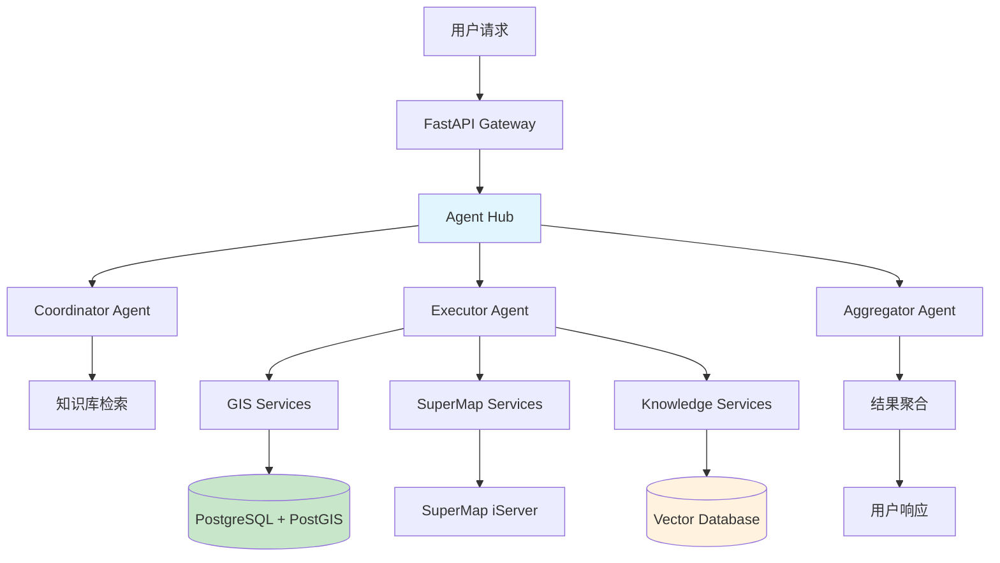

# SuperMap GIS + AI 智能分析系统 - 后端

<div align="center">


*基于多智能体协作的 GIS 智能分析平台后端服务*

**当前状态**: 🚧 Phase 1 开发中 | **完成度**: 35% | **总文件**: 94个

</div>

## 🎯 项目概述

本项目为**基于GIS-A2A的智能化城市管理分析平台**的后端服务，采用现代化微服务架构，为前端Vue.js应用提供完整的API支持。
在 DDD 和清洁架构思想下，API 层、应用层、领域层、基础设施层这四层架构各司其职，通过 “内层定义规则、外层提供支撑” 的协作模式，实现系统的 “业务稳定性” 与 “技术灵活性”。以下是四层架构的核心作用总结：
1. 领域层（Domain Layer）：业务的 “宪法”—— 定义核心规则与概念
核心作用：封装业务领域的 “本质逻辑”，是系统的 “灵魂”，不依赖任何技术实现。
具体职责：
定义核心业务概念（实体、值对象）：如 “空间要素”“用户”“坐标” 等，明确业务中 “是什么”；
制定不可违背的业务规则：如 “缓冲区半径必须> 0”“用户名必须唯一”，明确业务中 “什么能做、什么不能做”；
抽象数据操作接口（仓储接口）：规定 “需要对数据做什么”（如 “查询用户”“保存空间要素”），但不涉及 “如何做”（交给基础设施层实现）。
价值：确保业务逻辑的稳定性，无论技术框架或工具如何变化，核心业务规则不变。
2. 应用层（Application Layer）：业务的 “流程经理”—— 协调资源完成具体场景
核心作用：作为领域层与外部的 “桥梁”，负责业务流程的编排，不包含核心业务规则。
具体职责：
串联领域层组件：将领域层的实体、服务、仓储接口组合起来，完成完整业务用例（如 “用户登录→验证权限→执行缓冲区分析”）；
处理跨领域协作：当一个业务场景涉及多个领域（如 “智能体分析” 涉及 GIS 域、知识域、用户域），由应用层统一协调；
定义输入输出格式（DTO）：隔离外部请求与领域层实体，确保领域层不被外部参数直接干扰。
价值：让领域层专注于 “核心规则”，自己专注于 “流程落地”，灵活适配不同业务场景的需求。
3. API 层（API Layer）：系统的 “对外窗口”—— 接收请求并返回结果
核心作用：作为系统与外部（如前端、其他服务）的交互接口，负责 “请求入站” 和 “响应出站”。
具体职责：
定义 API 资源：通过接口端点（如/api/v1/gis/buffer-analysis）暴露系统能力，对应前端功能模块；
处理请求细节：验证参数格式（如 “半径是否为数字”）、解析请求头（如 JWT 令牌）、处理 HTTP 方法（GET/POST 等）；
转换响应格式：将应用层返回的结果整理为前端需要的 JSON 结构（如统一的{success: true, data: ...}格式）。
价值：隔离外部交互细节，让应用层和领域层无需关心 “前端用什么格式请求”，只专注于业务逻辑。
4. 基础设施层（Infrastructure Layer）：系统的 “技术工具集”—— 实现具体技术细节
核心作用：为所有内层（领域层、应用层、API 层）提供技术支持，屏蔽具体技术实现细节。
具体职责：
实现数据访问：根据领域层的仓储接口，用具体数据库（如 PostgreSQL、Redis）实现数据查询、存储（如用 SQL 查询用户、用 Redis 缓存结果）；
封装外部服务：将第三方工具 / 服务（如 SuperMap GIS、OpenAI）的接口封装为系统内部可用的工具（如SuperMapClient、LLMClient）；
提供通用技术能力：处理日志、监控、安全（如 JWT 加密）等非业务技术需求，统一支撑系统运行。
价值：隔离技术细节，当需要更换数据库、外部服务或框架时，只需修改基础设施层，不影响内层的业务逻辑。
5.core层负责与各个服务器进行连接
### 🎨 与前端功能对应

| 前端功能模块 | 后端服务支持 | 实现状态 |
|-------------|-------------|----------|
| **🤖 LLM智能模式** | `app/infrastructure/ai/` + `app/api/v1/agent/` | ⏳ Phase 3 |
| **🗺️ 传统GIS模式** | `app/api/v1/gis/` + `app/domains/gis/` | 🔥 Phase 1 |
| **👥 用户认证系统** | `app/api/v1/user/` + `app/core/security.py` | 🔥 进行中 |
| **📊 空间分析功能** | `app/application/use_cases/gis/` | ⏳ 待开始 |
| **💬 智能对话助手** | `app/infrastructure/ai/agent_hub.py` | ⏳ Phase 3 |
| **🗃️ 数据持久化** | `app/infrastructure/database/` | ⏳ Phase 2 |

## 📋 开发进度跟踪

### 🔥 当前阶段: Phase 1 - 传统模式API实现
**目标**: 实现前端传统模式下所有GIS功能的后端API支持

#### 📈 进度概览
- **总体进度**: 35% (35/100)
- **Phase 1 进度**: 60% (9/15)
- **预计完成时间**: 3天内

#### ✅ 已完成 (5项)
- [x] **项目架构设计** - 完整的DDD+清洁架构设计 ✅
- [x] **目录结构搭建** - 94个文件的完整项目结构 ✅
- [x] **用户认证系统** - JWT认证机制实现 ✅ 100%
- [x] **基础API框架** - FastAPI应用入口和中间件 ✅ 100%
- [x] **依赖注入模块** - 用户认证和权限控制依赖 ✅ 100%

#### 🔥 进行中 (4项)
- [x] **用户DTO重构** - 专门的DTO文件分离 ✅ 100%
- [x] **API文档编写** - 完整的用户认证API文档 ✅ 100%
- [x] **编码问题修复** - 修复所有中文编码和类型错误 ✅ 100%
- [ ] **SuperMap客户端** - SuperMap服务集成封装 ⏳

#### ⏳ 本周计划 (6项)
- [ ] **SuperMap客户端** - SuperMap服务集成封装
- [ ] **图层管理API** - 图层CRUD、显示控制
- [ ] **空间分析API** - 缓冲区、距离、可达性分析
- [ ] **要素查询API** - 属性查询、空间查询
- [ ] **配置管理系统** - 环境变量、配置文件
- [ ] **异常处理机制** - 统一错误处理

### 📊 详细进度跟踪

| 阶段 | 任务 | 状态 | 进度 | 负责人 | 截止时间 |
|------|------|------|------|--------|----------|
| **Phase 1.1** | 用户认证系统 | ✅ 已完成 | 100% | Dev Team | 已完成 |
| **Phase 1.2** | 基础API框架 | ✅ 已完成 | 100% | Dev Team | 已完成 |
| **Phase 1.3** | 依赖注入模块 | ✅ 已完成 | 100% | Dev Team | 已完成 |
| **Phase 1.4** | SuperMap服务代理 | 🔄 进行中 | 20% | Dev Team | 本周五 |
| **Phase 1.5** | GIS核心功能API | ⏳ 待开始 | 0% | Dev Team | 下周二 |
| **Phase 2.1** | 数据库架构设计 | ⏳ 待开始 | 0% | DB Team | 2周内 |
| **Phase 3.1** | 多智能体系统 | ⏳ 待开始 | 0% | AI Team | 4周内 |

### 🎯 本周重点目标
1. **✅ 用户认证系统已完成** - 支持前端登录注册功能
2. **✅ 基础API框架已完成** - FastAPI应用基础结构
3. **开始SuperMap集成** - SuperMap服务客户端封装
4. **开始GIS功能开发** - 图层管理API实现

**📋 查看完整开发路线图**: [PROJECT_PROGRESS.md](./PROJECT_PROGRESS.md)

### 🎉 最新完成功能 (2024-01-15)

#### ✅ **用户认证系统完整实现**
- **8个API端点**: 注册、登录、资料管理、密码修改等
- **完整文档**: 详细API文档和快速参考指南
- **DTO重构**: 专门的用户数据传输对象
- **依赖注入**: 统一的认证和权限控制
- **编码修复**: 解决所有中文编码和类型错误

#### ✅ **技术栈完善**
- **JWT认证**: python-jose + passlib 完整集成
- **类型安全**: 完整的类型注解和验证
- **错误处理**: 统一的HTTP错误响应
- **文档生成**: 自动生成Swagger/OpenAPI文档

#### 🔄 **当前进行中**
- **SuperMap集成**: 开始SuperMap服务客户端封装
- **GIS功能**: 准备开发图层管理和空间分析API

## 🧪 API测试指南

### 🚀 快速启动

```bash
# 1. 激活环境
conda activate pyside6

# 2. 进入Backend目录
cd Backend

# 3. 启动服务
python -m uvicorn app.main:app --reload --host 0.0.0.0 --port 8000
```

### 📚 API文档访问
- **Swagger UI**: http://localhost:8000/docs
- **ReDoc**: http://localhost:8000/redoc
- **健康检查**: http://localhost:8000/health

### 🔐 用户认证API测试

#### 1. 用户注册
```bash
curl -X POST "http://localhost:8000/api/v1/user/register" \
  -H "Content-Type: application/json" \
  -d '{
    "username": "testuser",
    "email": "test@example.com",
    "phone": "13800138000",
    "password": "password123",
    "confirm_password": "password123"
  }'
```

**期望响应**:
```json
{
  "success": true,
  "message": "用户注册成功",
  "data": {
    "username": "testuser"
  }
}
```

#### 2. 用户登录
```bash
# 支持用户名/邮箱/手机号登录
curl -X POST "http://localhost:8000/api/v1/user/login" \
  -H "Content-Type: application/json" \
  -d '{
    "login_identifier": "testuser",
    "password": "password123"
  }'

# 或者使用邮箱登录
curl -X POST "http://localhost:8000/api/v1/user/login" \
  -H "Content-Type: application/json" \
  -d '{
    "login_identifier": "test@example.com",
    "password": "password123"
  }'

# 或者使用手机号登录
curl -X POST "http://localhost:8000/api/v1/user/login" \
  -H "Content-Type: application/json" \
  -d '{
    "login_identifier": "13800138000",
    "password": "password123"
  }'
```

**期望响应**:
```json
{
  "success": true,
  "message": "登录成功",
  "token": "dummy_token_here",
  "data": {
    "username": "testuser"
  }
}
```

#### 3. 获取用户资料
```bash
curl -X GET "http://localhost:8000/api/v1/user/profile"
```

**期望响应**:
```json
{
  "id": 1,
  "username": "test_user",
  "email": "test@example.com",
  "phone": "13800138000",
  "is_active": true,
  "registered_at": "2024-01-15T10:30:00Z"
}
```

#### 4. 获取当前用户信息
```bash
curl -X GET "http://localhost:8000/api/v1/user/me"
```

**期望响应**:
```json
{
  "id": 1,
  "username": "test_user", 
  "email": "test@example.com",
  "phone": "13800138000",
  "is_active": true,
  "registered_at": "2024-01-15T10:30:00Z"
}
```

#### 5. 获取用户统计信息
```bash
curl -X GET "http://localhost:8000/api/v1/user/stats"
```

**期望响应**:
```json
{
  "success": true,
  "message": "统计信息获取成功",
  "data": {
    "total_users": 100,
    "active_users": 80,
    "new_users_today": 5
  }
}
```

#### 6. 用户登出
```bash
curl -X POST "http://localhost:8000/api/v1/user/logout"
```

**期望响应**:
```json
{
  "success": true,
  "message": "登出成功，已清除用户会话"
}
```

#### 7. 修改用户信息
```bash
curl -X POST "http://localhost:8000/api/v1/user/update-profile" \
  -H "Content-Type: application/json" \
  -d '{
    "old_username": "qianxi",
    "new_username": "qianxi_new",
    "old_email": "qianxi111@126.com",
    "new_email": "qianxi_new@126.com",
    "old_phone": "13800138000",
    "new_phone": "13900139000"
  }'
```

**期望响应**:
```json
{
  "success": true,
  "message": "用户信息修改成功",
  "data": {
    "old_info": {
      "username": "qianxi",
      "email": "qianxi111@126.com",
      "phone": "13800138000"
    },
    "new_info": {
      "username": "qianxi_new",
      "email": "qianxi_new@126.com",
      "phone": "13900139000"
    }
  }
}
```

**部分修改示例**:
```bash
# 只修改用户名
curl -X POST "http://localhost:8000/api/v1/user/update-profile" \
  -H "Content-Type: application/json" \
  -d '{
    "old_username": "qianxi",
    "new_username": "qianxi_new",
    "old_email": "qianxi111@126.com",
    "old_phone": "13800138000"
  }'

# 只修改邮箱
curl -X POST "http://localhost:8000/api/v1/user/update-profile" \
  -H "Content-Type: application/json" \
  -d '{
    "old_username": "qianxi",
    "old_email": "qianxi111@126.com",
    "new_email": "qianxi_new@126.com",
    "old_phone": "13800138000"
  }'
```

#### 8. 修改密码
```bash
curl -X POST "http://localhost:8000/api/v1/user/change-password" \
  -H "Content-Type: application/json" \
  -d '{
    "current_password": "qianxi147A",
    "new_password": "qianxi147B",
    "confirm_new_password": "qianxi147B"
  }'
```

**期望响应**:
```json
{
  "success": true,
  "message": "密码修改成功",
  "data": {
    "username": "qianxi",
    "message": "密码已更新，请使用新密码登录"
  }
}
```

**错误响应示例**:
```json
{
  "detail": "当前密码错误"
}
```

```json
{
  "detail": "新密码和确认密码不匹配"
}
```

```json
{
  "detail": "新密码不能与当前密码相同"
}
```

## 🏗️ 系统架构

### 整体架构图



### 整体文件架构图

  Backend/
  ├── app/
  │   ├── __init__.py
  │   ├── main.py                           # FastAPI应用入口
  │   │
  │   ├── core/                             # 核心基础设施
  │   │   ├── __init__.py
  │   │   ├── config.py                     # 统一配置管理
  │   │   ├── database.py                   # 数据库连接池
  │   │   ├── cache.py                      # Redis缓存
  │   │   ├── security.py                   # 安全相关
  │   │   ├── exceptions.py                 # 异常处理
  │   │   ├── logging.py                    # 日志配置
  │   │   └── middleware.py                 # 中间件
  │   │
  │   ├── domains/                          # 领域层(DDD)
  │   │   ├── __init__.py
  │   │   │
  │   │   ├── agent/                        # 智能体域
  │   │   │   ├── __init__.py
  │   │   │   ├── entities.py               # 实体定义
  │   │   │   ├── value_objects.py          # 值对象
  │   │   │   ├── repositories.py           # 仓储接口
  │   │   │   ├── services.py               # 领域服务
  │   │   │   └── events.py                 # 领域事件
  │   │   │
  │   │   ├── gis/                          # GIS域
  │   │   │   ├── __init__.py
  │   │   │   ├── entities.py
  │   │   │   ├── value_objects.py
  │   │   │   ├── repositories.py
  │   │   │   └── services.py
  │   │   │
  │   │   ├── knowledge/                    # 知识库域
  │   │   │   ├── __init__.py
  │   │   │   ├── entities.py
  │   │   │   ├── value_objects.py
  │   │   │   ├── repositories.py
  │   │   │   └── services.py
  │   │   │
  │   │   └── user/                         # 用户域
  │   │       ├── __init__.py
  │   │       ├── entities.py
  │   │       ├── value_objects.py
  │   │       ├── repositories.py
  │   │       └── services.py
  │   │
  │   ├── application/                      # 应用层
  │   │   ├── __init__.py
  │   │   ├── dto/                          # 数据传输对象
  │   │   │   ├── __init__.py
  │   │   │   ├── agent_dto.py
  │   │   │   ├── gis_dto.py
  │   │   │   ├── knowledge_dto.py
  │   │   │   └── user_dto.py
  │   │   │
  │   │   ├── use_cases/                    # 用例层
  │   │   │   ├── __init__.py
  │   │   │   ├── agent/
  │   │   │   │   ├── __init__.py
  │   │   │   │   ├── chat_use_case.py
  │   │   │   │   └── workflow_use_case.py
  │   │   │   ├── gis/
  │   │   │   │   ├── __init__.py
  │   │   │   │   ├── analysis_use_case.py
  │   │   │   │   └── query_use_case.py
  │   │   │   ├── knowledge/
  │   │   │   │   ├── __init__.py
  │   │   │   │   ├── search_use_case.py
  │   │   │   │   └── document_use_case.py
  │   │   │   └── user/
  │   │   │       ├── __init__.py
  │   │   │       ├── auth_use_case.py
  │   │   │       └── profile_use_case.py
  │   │   │
  │   │   └── handlers/                     # 事件处理器
  │   │       ├── __init__.py
  │   │       ├── agent_handlers.py
  │   │       ├── gis_handlers.py
  │   │       └── notification_handlers.py
  │   │
  │   ├── infrastructure/                   # 基础设施层
  │   │   ├── __init__.py
  │   │   │
  │   │   ├── ai/                           # AI基础设施
  │   │   │   ├── __init__.py
  │   │   │   ├── agent_hub.py              # 优化后的智能体中心
  │   │   │   ├── coordinator.py            # 协调智能体
  │   │   │   ├── executor.py               # 执行智能体  
  │   │   │   ├── aggregator.py             # 聚合智能体
  │   │   │   ├── tools/                    # 工具集
  │   │   │   │   ├── __init__.py
  │   │   │   │   ├── gis_tools.py
  │   │   │   │   ├── knowledge_tools.py
  │   │   │   │   └── analysis_tools.py
  │   │   │   └── prompts/                  # 提示词库
  │   │   │       ├── __init__.py
  │   │   │       ├── coordinator_prompts.py
  │   │   │       ├── executor_prompts.py
  │   │   │       └── aggregator_prompts.py
  │   │   │
  │   │   ├── database/                     # 数据访问层
  │   │   │   ├── __init__.py
  │   │   │   ├── postgres/
  │   │   │   │   ├── __init__.py
  │   │   │   │   ├── connection.py
  │   │   │   │   ├── models.py
  │   │   │   │   └── repositories.py
  │   │   │   ├── redis/
  │   │   │   │   ├── __init__.py
  │   │   │   │   ├── connection.py
  │   │   │   │   └── cache_service.py
  │   │   │   └── vector/
  │   │   │       ├── __init__.py
  │   │   │       ├── qdrant_client.py
  │   │   │       └── vector_service.py
  │   │   │
  │   │   ├── external/                     # 外部服务集成
  │   │   │   ├── __init__.py
  │   │   │   ├── supermap/
  │   │   │   │   ├── __init__.py
  │   │   │   │   ├── client.py
  │   │   │   │   ├── layer_service.py
  │   │   │   │   └── map_service.py
  │   │   │   └── llm/
  │   │   │       ├── __init__.py
  │   │   │       ├── openai_client.py
  │   │   │       └── embedding_client.py
  │   │   │
  │   │   └── monitoring/                   # 监控基础设施
  │   │       ├── __init__.py
  │   │       ├── metrics.py                # 指标收集
  │   │       ├── health_check.py           # 健康检查
  │   │       └── tracing.py                # 分布式追踪
  │   │
  │   ├── api/                              # 接口层
  │   │   ├── __init__.py
  │   │   ├── dependencies.py               # 依赖注入
  │   │   ├── middleware.py                 # API中间件
  │   │   │
  │   │   └── v1/                           # API版本1
  │   │       ├── __init__.py
  │   │       ├── agent/
  │   │       │   ├── __init__.py
  │   │       │   ├── chat.py
  │   │       │   └── workflow.py
  │   │       ├── gis/
  │   │       │   ├── __init__.py
  │   │       │   ├── analysis.py
  │   │       │   └── query.py
  │   │       ├── knowledge/
  │   │       │   ├── __init__.py
  │   │       │   ├── search.py
  │   │       │   └── documents.py
  │   │       ├── user/
  │   │       │   ├── __init__.py
  │   │       │   ├── auth.py
  │   │       │   └── profile.py
  │   │       └── health.py                 # 健康检查接口
  │   │
  │   └── tests/                            # 测试
  │       ├── __init__.py
  │       ├── conftest.py
  │       ├── unit/                         # 单元测试
  │       ├── integration/                  # 集成测试
  │       └── e2e/                          # 端到端测试
  │
  ├── migrations/                           # 数据库迁移
  ├── docker/                               # 容器配置
  ├── scripts/                              # 脚本工具
  ├── requirements.txt
  ├── pyproject.toml                        # 项目配置
  ├── Dockerfile
  ├── docker-compose.yml
  └── README.md

### 技术栈

| 分层 | 技术选型 | 说明 |
|------|----------|------|
| **API 层** | FastAPI + Uvicorn | 高性能异步 Web 框架 |
| **智能体层** | LangChain + OpenAI | 多智能体协作框架 |
| **应用层** | Python 3.11 + Pydantic | 业务逻辑 + 数据验证 |
| **数据层** | PostgreSQL + PostGIS | 关系型 + 空间数据库 |
| **缓存层** | Redis Cluster | 分布式缓存 |
| **向量层** | Qdrant/Weaviate | 向量数据库 |
| **监控** | Prometheus + Grafana | 系统监控 |

## 🚀 快速开始

### 1. 环境要求

- Python 3.11+
- Docker & Docker Compose
- PostgreSQL 15+ (with PostGIS)
- Redis 7+
- Git

### 2. 项目设置

```bash
# 1. 克隆项目
git clone <repository-url>
cd SuperMap/Backend

# 2. 创建虚拟环境
python -m venv venv
source venv/bin/activate  # Windows: venv\Scripts\activate

# 3. 安装依赖
pip install -r requirements.txt

# 4. 复制环境变量
cp .env.example .env
# 编辑 .env 文件，配置数据库和 API 密钥
```

### 3. 启动服务

```bash
# 启动数据库服务
docker-compose up -d postgres redis qdrant

# 数据库迁移
alembic upgrade head

# 启动开发服务器
python -m uvicorn app.main:app --reload --port 8000
```

### 4. 验证部署

```bash
# 健康检查
curl http://localhost:8000/api/v1/health

# API 文档
open http://localhost:8000/docs
```

## 🗺️ 核心功能

### 多智能体协作

```python
# 智能体工作流示例
user_query = "分析北京市医院500米缓冲区内的人口密度"

# 1. Coordinator: 解析意图
intent = coordinator.analyze_intent(user_query)
# → 缓冲区分析 + 人口统计查询

# 2. Executor: 并行执行
tasks = [
    gis_service.buffer_analysis("hospitals", 500),
    population_service.density_query("beijing")
]
results = await executor.execute_parallel(tasks)

# 3. Aggregator: 结果聚合
final_result = aggregator.combine_gis_stats(results)
```

### GIS 空间分析

- **缓冲区分析**: 基于 PostGIS 的高性能缓冲区计算
- **距离分析**: 点到点、点到线、面到面距离计算
- **可达性分析**: 基于路网的服务设施可达性
- **空间查询**: 相交、包含、邻接等空间关系查询

### 知识库 RAG

- **文档向量化**: OpenAI Embedding + 智能分块
- **混合检索**: 向量相似度 + BM25 关键词
- **上下文增强**: 检索结果增强 LLM 推理
- **实时更新**: 增量更新向量索引

## 📊 数据库设计

### 主库 (PostgreSQL + PostGIS)

```sql
-- 空间数据表
CREATE TABLE gis_features (
    id UUID PRIMARY KEY,
    name VARCHAR(255),
    geometry GEOMETRY(GEOMETRY, 4326),
    properties JSONB,
    created_at TIMESTAMP WITH TIME ZONE DEFAULT NOW()
);

-- 用户会话表  
CREATE TABLE chat_sessions (
    id UUID PRIMARY KEY,
    user_id UUID,
    messages JSONB[],
    context JSONB,
    created_at TIMESTAMP WITH TIME ZONE DEFAULT NOW()
);

-- 空间索引
CREATE INDEX idx_gis_features_geometry ON gis_features USING GIST (geometry);
```

### 缓存层 (Redis)

```bash
# 会话缓存
session:user_123 → {context, history, preferences}

# 查询缓存  
cache:gis:buffer:hospitals_500m → {geometry_results}

# 智能体状态
agent:status:workflow_456 → {stage, progress, intermediate_results}
```

### 向量数据库 (Qdrant)

```python
# 知识库文档向量
collection_config = {
    "vectors": {
        "size": 1536,  # OpenAI ada-002 dimensions
        "distance": "Cosine"
    },
    "payload_schema": {
        "document_id": "keyword",
        "chunk_text": "text", 
        "metadata": "object"
    }
}
```

## 🔧 API 接口

### 多智能体对话

```http
POST /api/v1/agent/chat
Content-Type: application/json

{
  "message": "帮我分析北京市三甲医院的空间分布特征",
  "context": {
    "city": "北京市",
    "poi_type": "三甲医院"
  },
  "stream": true
}
```

### GIS 分析服务

```http
POST /api/v1/gis/buffer-analysis
Content-Type: application/json

{
  "geometry": {
    "type": "Point",
    "coordinates": [116.4074, 39.9042]
  },
  "radius": 1000,
  "unit": "meters"
}
```

### 知识库检索

```http
POST /api/v1/knowledge/search  
Content-Type: application/json

{
  "query": "GIS缓冲区分析的算法原理",
  "top_k": 5,
  "include_metadata": true
}
```

## 🏭 部署配置

### Docker 生产环境

```yaml
# docker-compose.prod.yml
version: '3.8'
services:
  backend:
    build: 
      context: .
      dockerfile: Dockerfile.prod
    environment:
      - ENVIRONMENT=production
      - DATABASE_URL=postgresql://...
      - REDIS_URL=redis://...
    deploy:
      replicas: 3
      resources:
        limits:
          cpus: '2'
          memory: 4G
```

### Kubernetes 部署

```yaml
# k8s/deployment.yaml
apiVersion: apps/v1
kind: Deployment
metadata:
  name: supermap-backend
spec:
  replicas: 3
  selector:
    matchLabels:
      app: supermap-backend
  template:
    spec:
      containers:
      - name: backend
        image: supermap/backend:latest
        resources:
          requests:
            memory: "2Gi"
            cpu: "1"
          limits:
            memory: "4Gi"
            cpu: "2"
```

## 📈 性能监控

### 关键指标

| 指标类型 | 目标值 | 监控方式 |
|----------|--------|----------|
| **API 响应时间** | P95 < 500ms | Prometheus + Grafana |
| **智能体处理时间** | P95 < 3s | 自定义 Metrics |
| **数据库连接** | 使用率 < 80% | PostgreSQL Exporter |
| **缓存命中率** | > 90% | Redis Metrics |
| **向量检索延迟** | P99 < 100ms | Qdrant Metrics |

### 告警规则

```yaml
# prometheus/alerts.yml
groups:
- name: supermap-backend
  rules:
  - alert: HighResponseTime
    expr: histogram_quantile(0.95, http_request_duration_seconds) > 0.5
    for: 2m
    
  - alert: DatabaseConnectionHigh  
    expr: pg_stat_activity_count / pg_settings_max_connections > 0.8
    for: 5m
```

## 🧪 测试

### 运行测试

```bash
# 单元测试
pytest app/tests/unit/ -v

# 集成测试  
pytest app/tests/integration/ -v

# 端到端测试
pytest app/tests/e2e/ -v

# 性能测试
locust -f tests/performance/locustfile.py --host=http://localhost:8000
```

### 测试覆盖率

```bash
# 生成覆盖率报告
pytest --cov=app --cov-report=html
open htmlcov/index.html
```

## 🛠️ 开发指南

### 项目结构

```
Backend/
├── app/
│   ├── core/                 # 核心配置
│   ├── domains/              # 领域模型 (DDD)
│   │   ├── agent/           # 智能体域
│   │   ├── gis/             # GIS 域
│   │   ├── knowledge/       # 知识库域
│   │   └── user/            # 用户域
│   ├── application/          # 应用层
│   │   ├── use_cases/       # 用例
│   │   ├── dto/             # 数据传输对象
│   │   └── handlers/        # 事件处理
│   ├── infrastructure/       # 基础设施
│   │   ├── ai/              # AI 服务
│   │   ├── database/        # 数据访问
│   │   └── external/        # 外部集成
│   └── api/                 # API 层
├── migrations/              # 数据库迁移
└── tests/                   # 测试用例
```

### 代码规范

```bash
# 代码格式化
black app/
isort app/

# 类型检查
mypy app/

# 代码质量检查  
flake8 app/
pylint app/
```

### 新功能开发流程

1. **领域建模**: 在 `app/domains/` 定义实体和服务
2. **用例实现**: 在 `app/application/use_cases/` 实现业务逻辑  
3. **基础设施**: 在 `app/infrastructure/` 实现技术细节
4. **API 接口**: 在 `app/api/` 暴露 HTTP 接口
5. **测试用例**: 编写单元和集成测试
6. **文档更新**: 更新 API 文档和部署文档

## 🔗 相关链接

- [API 文档](http://localhost:8000/docs)
- [SuperMap 官网](https://www.supermap.com)
- [LangChain 文档](https://python.langchain.com)
- [FastAPI 文档](https://fastapi.tiangolo.com)
- [PostGIS 文档](https://postgis.net)

## 👥 贡献指南

1. Fork 本仓库
2. 创建特性分支 (`git checkout -b feature/AmazingFeature`)
3. 提交更改 (`git commit -m 'Add some AmazingFeature'`)  
4. 推送到分支 (`git push origin feature/AmazingFeature`)
5. 打开 Pull Request

## 📜 许可证

本项目采用 MIT 许可证 - 查看 [LICENSE](LICENSE) 文件了解详情。

## 📞 支持

如有问题或建议，请：

- 创建 [Issue](../../issues)
- 发送邮件至: [your-email@example.com](mailto:your-email@example.com)
- 加入我们的 [Discord](https://discord.gg/your-invite) 社区

---

<div align="center">
Made with ❤️ by SuperMap GIS Team
</div>