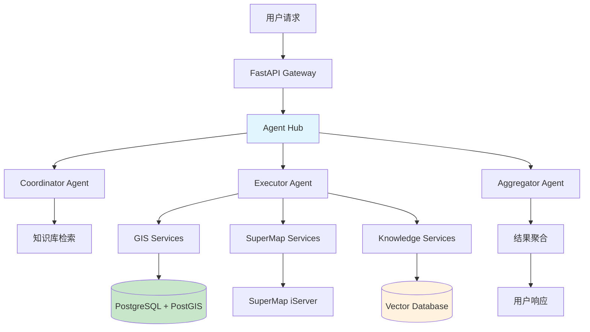

# SuperMap GIS + AI 智能分析系统 - 后端

<div align="center">


*基于多智能体协作的 GIS 智能分析平台后端服务*

</div>

## 🌟 项目亮点

- **🤖 多智能体协作**: 3层智能体架构 (Coordinator → Executor → Aggregator)
- **🗺️ GIS 分析能力**: 集成 PostGIS + SuperMap，支持复杂空间分析
- **🧠 RAG 增强**: 知识库检索增强生成，智能调度后端服务
- **⚡ 高性能**: 异步处理 + 并行执行 + 多层缓存
- **🏗️ 清洁架构**: DDD 领域驱动 + 依赖倒置 + 松耦合设计

## 🏗️ 系统架构

### 整体架构图



### 整体文件架构图

  Backend/
  ├── app/
  │   ├── __init__.py
  │   ├── main.py                           # FastAPI应用入口
  │   │
  │   ├── core/                             # 核心基础设施
  │   │   ├── __init__.py
  │   │   ├── config.py                     # 统一配置管理
  │   │   ├── database.py                   # 数据库连接池
  │   │   ├── cache.py                      # Redis缓存
  │   │   ├── security.py                   # 安全相关
  │   │   ├── exceptions.py                 # 异常处理
  │   │   ├── logging.py                    # 日志配置
  │   │   └── middleware.py                 # 中间件
  │   │
  │   ├── domains/                          # 领域层(DDD)
  │   │   ├── __init__.py
  │   │   │
  │   │   ├── agent/                        # 智能体域
  │   │   │   ├── __init__.py
  │   │   │   ├── entities.py               # 实体定义
  │   │   │   ├── value_objects.py          # 值对象
  │   │   │   ├── repositories.py           # 仓储接口
  │   │   │   ├── services.py               # 领域服务
  │   │   │   └── events.py                 # 领域事件
  │   │   │
  │   │   ├── gis/                          # GIS域
  │   │   │   ├── __init__.py
  │   │   │   ├── entities.py
  │   │   │   ├── value_objects.py
  │   │   │   ├── repositories.py
  │   │   │   └── services.py
  │   │   │
  │   │   ├── knowledge/                    # 知识库域
  │   │   │   ├── __init__.py
  │   │   │   ├── entities.py
  │   │   │   ├── value_objects.py
  │   │   │   ├── repositories.py
  │   │   │   └── services.py
  │   │   │
  │   │   └── user/                         # 用户域
  │   │       ├── __init__.py
  │   │       ├── entities.py
  │   │       ├── value_objects.py
  │   │       ├── repositories.py
  │   │       └── services.py
  │   │
  │   ├── application/                      # 应用层
  │   │   ├── __init__.py
  │   │   ├── dto/                          # 数据传输对象
  │   │   │   ├── __init__.py
  │   │   │   ├── agent_dto.py
  │   │   │   ├── gis_dto.py
  │   │   │   ├── knowledge_dto.py
  │   │   │   └── user_dto.py
  │   │   │
  │   │   ├── use_cases/                    # 用例层
  │   │   │   ├── __init__.py
  │   │   │   ├── agent/
  │   │   │   │   ├── __init__.py
  │   │   │   │   ├── chat_use_case.py
  │   │   │   │   └── workflow_use_case.py
  │   │   │   ├── gis/
  │   │   │   │   ├── __init__.py
  │   │   │   │   ├── analysis_use_case.py
  │   │   │   │   └── query_use_case.py
  │   │   │   ├── knowledge/
  │   │   │   │   ├── __init__.py
  │   │   │   │   ├── search_use_case.py
  │   │   │   │   └── document_use_case.py
  │   │   │   └── user/
  │   │   │       ├── __init__.py
  │   │   │       ├── auth_use_case.py
  │   │   │       └── profile_use_case.py
  │   │   │
  │   │   └── handlers/                     # 事件处理器
  │   │       ├── __init__.py
  │   │       ├── agent_handlers.py
  │   │       ├── gis_handlers.py
  │   │       └── notification_handlers.py
  │   │
  │   ├── infrastructure/                   # 基础设施层
  │   │   ├── __init__.py
  │   │   │
  │   │   ├── ai/                           # AI基础设施
  │   │   │   ├── __init__.py
  │   │   │   ├── agent_hub.py              # 优化后的智能体中心
  │   │   │   ├── coordinator.py            # 协调智能体
  │   │   │   ├── executor.py               # 执行智能体  
  │   │   │   ├── aggregator.py             # 聚合智能体
  │   │   │   ├── tools/                    # 工具集
  │   │   │   │   ├── __init__.py
  │   │   │   │   ├── gis_tools.py
  │   │   │   │   ├── knowledge_tools.py
  │   │   │   │   └── analysis_tools.py
  │   │   │   └── prompts/                  # 提示词库
  │   │   │       ├── __init__.py
  │   │   │       ├── coordinator_prompts.py
  │   │   │       ├── executor_prompts.py
  │   │   │       └── aggregator_prompts.py
  │   │   │
  │   │   ├── database/                     # 数据访问层
  │   │   │   ├── __init__.py
  │   │   │   ├── postgres/
  │   │   │   │   ├── __init__.py
  │   │   │   │   ├── connection.py
  │   │   │   │   ├── models.py
  │   │   │   │   └── repositories.py
  │   │   │   ├── redis/
  │   │   │   │   ├── __init__.py
  │   │   │   │   ├── connection.py
  │   │   │   │   └── cache_service.py
  │   │   │   └── vector/
  │   │   │       ├── __init__.py
  │   │   │       ├── qdrant_client.py
  │   │   │       └── vector_service.py
  │   │   │
  │   │   ├── external/                     # 外部服务集成
  │   │   │   ├── __init__.py
  │   │   │   ├── supermap/
  │   │   │   │   ├── __init__.py
  │   │   │   │   ├── client.py
  │   │   │   │   ├── layer_service.py
  │   │   │   │   └── map_service.py
  │   │   │   └── llm/
  │   │   │       ├── __init__.py
  │   │   │       ├── openai_client.py
  │   │   │       └── embedding_client.py
  │   │   │
  │   │   └── monitoring/                   # 监控基础设施
  │   │       ├── __init__.py
  │   │       ├── metrics.py                # 指标收集
  │   │       ├── health_check.py           # 健康检查
  │   │       └── tracing.py                # 分布式追踪
  │   │
  │   ├── api/                              # 接口层
  │   │   ├── __init__.py
  │   │   ├── dependencies.py               # 依赖注入
  │   │   ├── middleware.py                 # API中间件
  │   │   │
  │   │   └── v1/                           # API版本1
  │   │       ├── __init__.py
  │   │       ├── agent/
  │   │       │   ├── __init__.py
  │   │       │   ├── chat.py
  │   │       │   └── workflow.py
  │   │       ├── gis/
  │   │       │   ├── __init__.py
  │   │       │   ├── analysis.py
  │   │       │   └── query.py
  │   │       ├── knowledge/
  │   │       │   ├── __init__.py
  │   │       │   ├── search.py
  │   │       │   └── documents.py
  │   │       ├── user/
  │   │       │   ├── __init__.py
  │   │       │   ├── auth.py
  │   │       │   └── profile.py
  │   │       └── health.py                 # 健康检查接口
  │   │
  │   └── tests/                            # 测试
  │       ├── __init__.py
  │       ├── conftest.py
  │       ├── unit/                         # 单元测试
  │       ├── integration/                  # 集成测试
  │       └── e2e/                          # 端到端测试
  │
  ├── migrations/                           # 数据库迁移
  ├── docker/                               # 容器配置
  ├── scripts/                              # 脚本工具
  ├── requirements.txt
  ├── pyproject.toml                        # 项目配置
  ├── Dockerfile
  ├── docker-compose.yml
  └── README.md

### 技术栈

| 分层 | 技术选型 | 说明 |
|------|----------|------|
| **API 层** | FastAPI + Uvicorn | 高性能异步 Web 框架 |
| **智能体层** | LangChain + OpenAI | 多智能体协作框架 |
| **应用层** | Python 3.11 + Pydantic | 业务逻辑 + 数据验证 |
| **数据层** | PostgreSQL + PostGIS | 关系型 + 空间数据库 |
| **缓存层** | Redis Cluster | 分布式缓存 |
| **向量层** | Qdrant/Weaviate | 向量数据库 |
| **监控** | Prometheus + Grafana | 系统监控 |

## 🚀 快速开始

### 1. 环境要求

- Python 3.11+
- Docker & Docker Compose
- PostgreSQL 15+ (with PostGIS)
- Redis 7+
- Git

### 2. 项目设置

```bash
# 1. 克隆项目
git clone <repository-url>
cd SuperMap/Backend

# 2. 创建虚拟环境
python -m venv venv
source venv/bin/activate  # Windows: venv\Scripts\activate

# 3. 安装依赖
pip install -r requirements.txt

# 4. 复制环境变量
cp .env.example .env
# 编辑 .env 文件，配置数据库和 API 密钥
```

### 3. 启动服务

```bash
# 启动数据库服务
docker-compose up -d postgres redis qdrant

# 数据库迁移
alembic upgrade head

# 启动开发服务器
python -m uvicorn app.main:app --reload --port 8000
```

### 4. 验证部署

```bash
# 健康检查
curl http://localhost:8000/api/v1/health

# API 文档
open http://localhost:8000/docs
```

## 🗺️ 核心功能

### 多智能体协作

```python
# 智能体工作流示例
user_query = "分析北京市医院500米缓冲区内的人口密度"

# 1. Coordinator: 解析意图
intent = coordinator.analyze_intent(user_query)
# → 缓冲区分析 + 人口统计查询

# 2. Executor: 并行执行
tasks = [
    gis_service.buffer_analysis("hospitals", 500),
    population_service.density_query("beijing")
]
results = await executor.execute_parallel(tasks)

# 3. Aggregator: 结果聚合
final_result = aggregator.combine_gis_stats(results)
```

### GIS 空间分析

- **缓冲区分析**: 基于 PostGIS 的高性能缓冲区计算
- **距离分析**: 点到点、点到线、面到面距离计算
- **可达性分析**: 基于路网的服务设施可达性
- **空间查询**: 相交、包含、邻接等空间关系查询

### 知识库 RAG

- **文档向量化**: OpenAI Embedding + 智能分块
- **混合检索**: 向量相似度 + BM25 关键词
- **上下文增强**: 检索结果增强 LLM 推理
- **实时更新**: 增量更新向量索引

## 📊 数据库设计

### 主库 (PostgreSQL + PostGIS)

```sql
-- 空间数据表
CREATE TABLE gis_features (
    id UUID PRIMARY KEY,
    name VARCHAR(255),
    geometry GEOMETRY(GEOMETRY, 4326),
    properties JSONB,
    created_at TIMESTAMP WITH TIME ZONE DEFAULT NOW()
);

-- 用户会话表  
CREATE TABLE chat_sessions (
    id UUID PRIMARY KEY,
    user_id UUID,
    messages JSONB[],
    context JSONB,
    created_at TIMESTAMP WITH TIME ZONE DEFAULT NOW()
);

-- 空间索引
CREATE INDEX idx_gis_features_geometry ON gis_features USING GIST (geometry);
```

### 缓存层 (Redis)

```bash
# 会话缓存
session:user_123 → {context, history, preferences}

# 查询缓存  
cache:gis:buffer:hospitals_500m → {geometry_results}

# 智能体状态
agent:status:workflow_456 → {stage, progress, intermediate_results}
```

### 向量数据库 (Qdrant)

```python
# 知识库文档向量
collection_config = {
    "vectors": {
        "size": 1536,  # OpenAI ada-002 dimensions
        "distance": "Cosine"
    },
    "payload_schema": {
        "document_id": "keyword",
        "chunk_text": "text", 
        "metadata": "object"
    }
}
```

## 🔧 API 接口

### 多智能体对话

```http
POST /api/v1/agent/chat
Content-Type: application/json

{
  "message": "帮我分析北京市三甲医院的空间分布特征",
  "context": {
    "city": "北京市",
    "poi_type": "三甲医院"
  },
  "stream": true
}
```

### GIS 分析服务

```http
POST /api/v1/gis/buffer-analysis
Content-Type: application/json

{
  "geometry": {
    "type": "Point",
    "coordinates": [116.4074, 39.9042]
  },
  "radius": 1000,
  "unit": "meters"
}
```

### 知识库检索

```http
POST /api/v1/knowledge/search  
Content-Type: application/json

{
  "query": "GIS缓冲区分析的算法原理",
  "top_k": 5,
  "include_metadata": true
}
```

## 🏭 部署配置

### Docker 生产环境

```yaml
# docker-compose.prod.yml
version: '3.8'
services:
  backend:
    build: 
      context: .
      dockerfile: Dockerfile.prod
    environment:
      - ENVIRONMENT=production
      - DATABASE_URL=postgresql://...
      - REDIS_URL=redis://...
    deploy:
      replicas: 3
      resources:
        limits:
          cpus: '2'
          memory: 4G
```

### Kubernetes 部署

```yaml
# k8s/deployment.yaml
apiVersion: apps/v1
kind: Deployment
metadata:
  name: supermap-backend
spec:
  replicas: 3
  selector:
    matchLabels:
      app: supermap-backend
  template:
    spec:
      containers:
      - name: backend
        image: supermap/backend:latest
        resources:
          requests:
            memory: "2Gi"
            cpu: "1"
          limits:
            memory: "4Gi"
            cpu: "2"
```

## 📈 性能监控

### 关键指标

| 指标类型 | 目标值 | 监控方式 |
|----------|--------|----------|
| **API 响应时间** | P95 < 500ms | Prometheus + Grafana |
| **智能体处理时间** | P95 < 3s | 自定义 Metrics |
| **数据库连接** | 使用率 < 80% | PostgreSQL Exporter |
| **缓存命中率** | > 90% | Redis Metrics |
| **向量检索延迟** | P99 < 100ms | Qdrant Metrics |

### 告警规则

```yaml
# prometheus/alerts.yml
groups:
- name: supermap-backend
  rules:
  - alert: HighResponseTime
    expr: histogram_quantile(0.95, http_request_duration_seconds) > 0.5
    for: 2m
    
  - alert: DatabaseConnectionHigh  
    expr: pg_stat_activity_count / pg_settings_max_connections > 0.8
    for: 5m
```

## 🧪 测试

### 运行测试

```bash
# 单元测试
pytest app/tests/unit/ -v

# 集成测试  
pytest app/tests/integration/ -v

# 端到端测试
pytest app/tests/e2e/ -v

# 性能测试
locust -f tests/performance/locustfile.py --host=http://localhost:8000
```

### 测试覆盖率

```bash
# 生成覆盖率报告
pytest --cov=app --cov-report=html
open htmlcov/index.html
```

## 🛠️ 开发指南

### 项目结构

```
Backend/
├── app/
│   ├── core/                 # 核心配置
│   ├── domains/              # 领域模型 (DDD)
│   │   ├── agent/           # 智能体域
│   │   ├── gis/             # GIS 域
│   │   ├── knowledge/       # 知识库域
│   │   └── user/            # 用户域
│   ├── application/          # 应用层
│   │   ├── use_cases/       # 用例
│   │   ├── dto/             # 数据传输对象
│   │   └── handlers/        # 事件处理
│   ├── infrastructure/       # 基础设施
│   │   ├── ai/              # AI 服务
│   │   ├── database/        # 数据访问
│   │   └── external/        # 外部集成
│   └── api/                 # API 层
├── migrations/              # 数据库迁移
└── tests/                   # 测试用例
```

### 代码规范

```bash
# 代码格式化
black app/
isort app/

# 类型检查
mypy app/

# 代码质量检查  
flake8 app/
pylint app/
```

### 新功能开发流程

1. **领域建模**: 在 `app/domains/` 定义实体和服务
2. **用例实现**: 在 `app/application/use_cases/` 实现业务逻辑  
3. **基础设施**: 在 `app/infrastructure/` 实现技术细节
4. **API 接口**: 在 `app/api/` 暴露 HTTP 接口
5. **测试用例**: 编写单元和集成测试
6. **文档更新**: 更新 API 文档和部署文档

## 🔗 相关链接

- [API 文档](http://localhost:8000/docs)
- [SuperMap 官网](https://www.supermap.com)
- [LangChain 文档](https://python.langchain.com)
- [FastAPI 文档](https://fastapi.tiangolo.com)
- [PostGIS 文档](https://postgis.net)

## 👥 贡献指南

1. Fork 本仓库
2. 创建特性分支 (`git checkout -b feature/AmazingFeature`)
3. 提交更改 (`git commit -m 'Add some AmazingFeature'`)  
4. 推送到分支 (`git push origin feature/AmazingFeature`)
5. 打开 Pull Request

## 📜 许可证

本项目采用 MIT 许可证 - 查看 [LICENSE](LICENSE) 文件了解详情。

## 📞 支持

如有问题或建议，请：

- 创建 [Issue](../../issues)
- 发送邮件至: [your-email@example.com](mailto:your-email@example.com)
- 加入我们的 [Discord](https://discord.gg/your-invite) 社区

---

<div align="center">
Made with ❤️ by SuperMap GIS Team
</div>